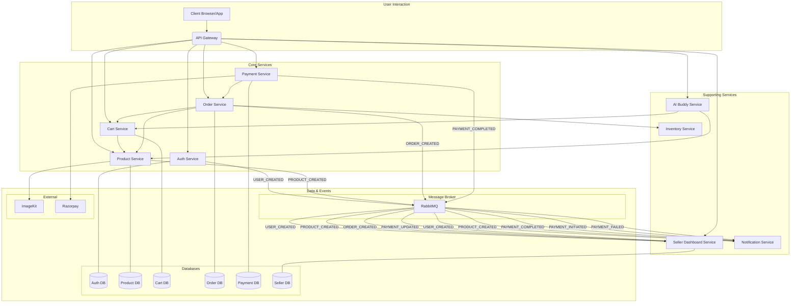
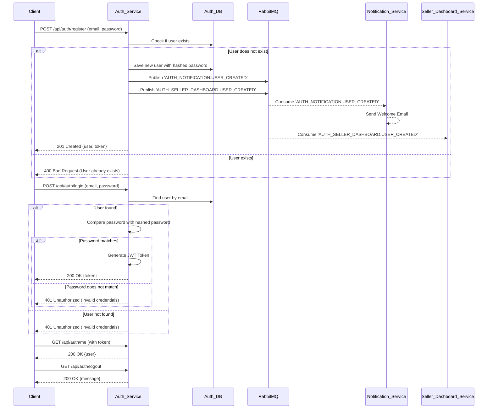
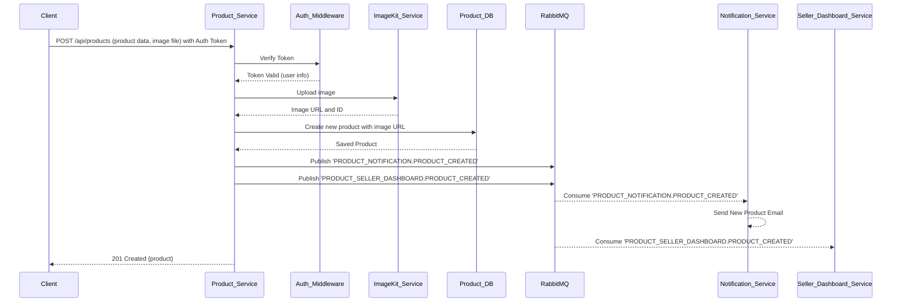
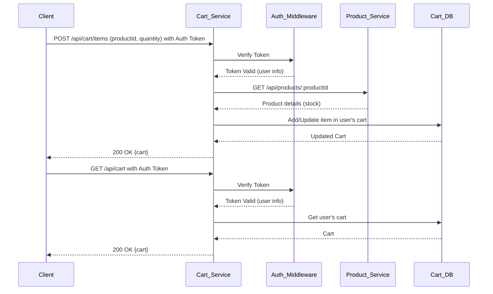
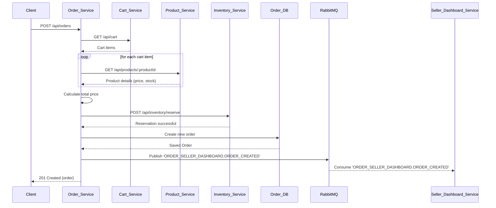
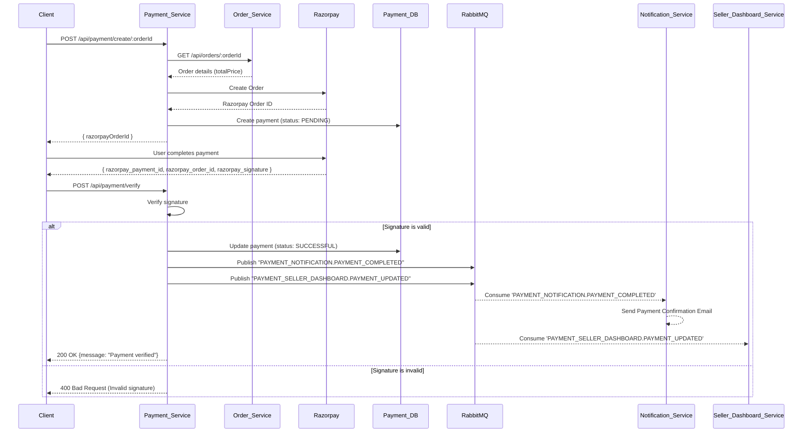
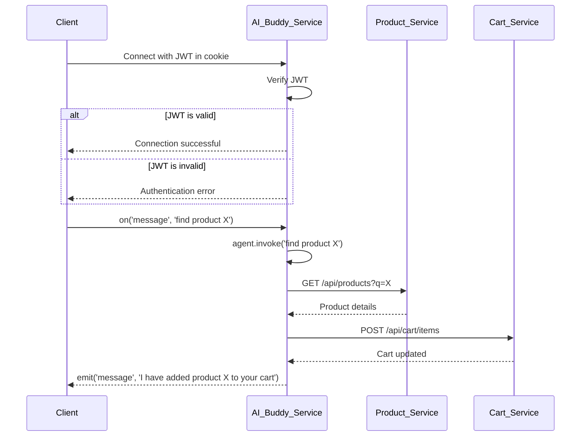

# 🚀 microBazaar: Your Next-Gen Microservices E-commerce Platform 🚀

Welcome to **microBazaar**! This project is an ambitious journey into building a scalable, resilient, and feature-rich e-commerce platform using a microservices architecture. We're crafting a digital marketplace where every component works harmoniously yet independently, ensuring a robust and dynamic user experience.

## ✨ The microBazaar Vision: Why Microservices?

Imagine an e-commerce platform that can grow limitlessly, where new features can be added without disrupting existing ones, and where a hiccup in one area doesn't bring down the entire store. That's the power of microservices, and that's the vision for microBazaar!

We're breaking down the traditional monolithic application into smaller, manageable, and independently deployable services. This approach brings a plethora of benefits:

-   **Scalability:** Each service can be scaled independently based on its demand.
-   **Resilience:** A failure in one service won't cascade and affect the entire application.
-   **Agility:** Faster development cycles and easier deployment of new features.
-   **Technology Diversity:** Freedom to choose the best technology stack for each service.

## 🗺️ Architectural Blueprint: How It All Connects

microBazaar is designed as a constellation of specialized services, each handling a distinct domain of the e-commerce ecosystem. Think of it as a bustling marketplace where different shops (microservices) specialize in their craft, yet work together to serve the customer.

Initially, services communicate directly via RESTful APIs. However, the architecture is evolving to an event-driven model for more robust, scalable, and decoupled communication.

-   **Asynchronous Communication with CloudAMQP:** To ensure seamless and fault-tolerant communication, we use **CloudAMQP**, a managed RabbitMQ message broker. This acts as the central nervous system, allowing services to communicate asynchronously. For example, when a user registers, the `Auth Service` publishes a `USER_CREATED` event, and the `Notification Service` consumes this event to send a welcome email, all without the services being directly dependent on each other. The connection is configured via a `RABBIT_URL` environment variable.

-   **AWS Cloud Hosting:** Each microservice will find its home on **Amazon Web Services (AWS)**. We envision deploying these services independently across various AWS compute options (e.g., EC2, ECS, Lambda), leveraging AWS's robust infrastructure for high availability, scalability, and global reach. Each service will be a separate entity in the cloud, connecting securely to form the complete microBazaar platform.

## 🐳 Containerization with Docker

Each microservice in the microBazaar platform is containerized using Docker. This ensures that each service has a consistent and isolated environment, making it easy to develop, test, and deploy the services independently. The `dockerfile` for each service is based on the `node:18-alpine` image and follows a standard pattern:

1.  **Set the working directory:** The working directory is set to `/app`.
2.  **Copy package files:** The `package.json` and `package-lock.json` files are copied to the container.
3.  **Install dependencies:** `npm install` is run to install the service's dependencies.
4.  **Copy source code:** The rest of the service's source code is copied to the container.
5.  **Expose port:** The port that the service listens on is exposed.
6.  **Start the service:** The service is started using `npm start`.

This consistent approach to containerization simplifies the deployment process and makes it easy to manage the services in a production environment.

## 🚀 Getting Started: Join the microBazaar Journey!

Ready to dive into the code? Head over to the [Local Development](#-local-development) section to get microBazaar up and running on your local machine.

## 🏡 Local Development

Follow these steps to get microBazaar up and running on your local machine:

1.  **Clone the repository:**
    ```bash
    git clone https://github.com/your-username/microBazaar.git
    ```
2.  **Set up environment variables:**
    Each service requires its own set of environment variables to run correctly. Navigate to each service's directory, create a `.env` file, and add the necessary variables. Refer to the [Environment Variables](#-environment-variables) section for a complete list of variables for each service.

3.  **Install dependencies and run the services:**
    For each service you want to run:
    ```bash
    cd microBazaar/<service-name>  # e.g., cd microBazaar/auth
    npm install
    npm run dev
    ```
    You will need to run each service in a separate terminal window.

## 🔑 Environment Variables

Each service in microBazaar requires a `.env` file in its root directory with the following environment variables:

### All Services
-   `MONGO_URI`: The connection string for your MongoDB database.
-   `RABBIT_URL`: The connection string for your RabbitMQ instance (e.g., from CloudAMQP).
-   `NODE_ENV`: Set to `development` for local development.

### Auth Service
-   `JWT_SECRET`: A secret key for signing JWT tokens.
-   `REDIS_HOST`: The host for your Redis instance.
-   `REDIS_PORT`: The port for your Redis instance.
-   `REDIS_PASSWORD`: The password for your Redis instance.

### Product Service
-   `IMAGEKIT_PUBLIC_KEY`: Your public key from ImageKit.
-   `IMAGEKIT_PRIVATE_KEY`: Your private key from ImageKit.
-   `IMAGEKIT_URL_ENDPOINT`: Your URL endpoint from ImageKit.

### Payment Service
-   `RAZORPAY_KEY_ID`: Your key ID from Razorpay.
-   `RAZORPAY_KEY_SECRET`: Your key secret from Razorpay.

## ☁️ AWS Deployment

**Disclaimer:** The original AWS deployment for this project has been shut down due to the high costs associated with maintaining the infrastructure. The following is a general guide on how you can deploy the microBazaar services to your own AWS account.

The containerized nature of the microBazaar services makes them ideal for deployment to AWS. Here's a general guide to deploying the services using Amazon ECS:

1.  **Prerequisites:**
    -   An AWS account.
    -   AWS CLI installed and configured on your local machine.
    -   Docker installed on your local machine.

2.  **Create an ECR Repository for Each Service:**
    For each microservice, create a new private repository in Amazon Elastic Container Registry (ECR). This is where you will store your Docker images.

3.  **Build and Push Docker Images:**
    For each service:
    a.  Navigate to the service's directory.
    b.  Build the Docker image: `docker build -t <repository-uri> .`
    c.  Authenticate Docker to your ECR registry.
    d.  Push the image to ECR: `docker push <repository-uri>`

4.  **Set up an ECS Cluster:**
    Create a new ECS cluster to run your containers. You can choose between the Fargate (serverless) or EC2 launch types.

5.  **Create Task Definitions:**
    For each service, create a new task definition in ECS. In the task definition, you will:
    -   Specify the Docker image to use (the one you pushed to ECR).
    -   Define the CPU and memory resources for the task.
    -   Configure the container's port mappings.
    -   **Crucially, define the environment variables** required for the service to run. You can inject these directly or use AWS Secrets Manager for sensitive values.

6.  **Create Services:**
    For each task definition, create a new service in your ECS cluster. The service will ensure that the specified number of tasks are running and will handle task replacement if a task fails.

7.  **Set up an Application Load Balancer (ALB):**
    Create an ALB to route incoming traffic to your services. You will need to create target groups for each service and configure listener rules on the ALB to route traffic based on the path (e.g., `/api/auth/*` goes to the auth service).

8.  **Configure Security Groups:**
    Ensure that your security groups are configured correctly to allow traffic between the ALB, the ECS tasks, and any other AWS resources they need to communicate with (like your database).

This is a high-level overview. For detailed instructions, please refer to the official AWS documentation for ECR, ECS, and ALB.

## 📊 Architecture and Flow Diagrams

### High-Level Architecture



### User Authentication Flow



### New Product Flow



### Cart Management Flow



### Order Creation Flow



### Payment Flow



### AI Buddy Socket Connection Flow



## 🌟 Current Services Spotlight

Here are the foundational services currently powering microBazaar:

### 🔐 Auth Service

-   **Port:** `3000`
-   **Description:** The gatekeeper of microBazaar! This service is responsible for all things user authentication – from secure registration and login to generating and validating access tokens. It ensures that only legitimate users can access protected resources. It communicates with the Notification and Seller Dashboard services via RabbitMQ. It also manages user addresses.
-   **Key Technologies:** `Node.js`, `Express`, `MongoDB`, `JWT`, `bcryptjs`, `ioredis` (for session/token management), `amqplib`.

#### API Endpoints

| Method | Endpoint                       | Description                      | Auth Required |
| :----- | :----------------------------- | :------------------------------- | :------------ |
| POST   | `/api/auth/register`           | Register a new user              | No            |
| POST   | `/api/auth/login`              | Login a user                     | No            |
| GET    | `/api/auth/me`                 | Get current user details         | Yes           |
| GET    | `/api/auth/logout`             | Logout the current user          | No            |
| POST   | `/api/auth/users/me/addresses` | Add a new address for the user   | Yes           |
| GET    | `/api/auth/users/me/addresses` | Get all addresses for the user   | Yes           |
| DELETE | `/api/auth/users/me/addresses/:addressId` | Delete a user's address | Yes           |

### 🛍️ Product Service

-   **Port:** `3001`
-   **Description:** The heart of our catalog! This service meticulously manages all product-related operations. It handles creating new products, retrieving product details, updating inventory information, and even managing product images with `ImageKit`. It publishes events to the Notification and Seller Dashboard services when a new product is created.
-   **Key Technologies:** `Node.js`, `Express`, `MongoDB`, `ImageKit`, `Multer` (for file uploads), `amqplib`.

#### API Endpoints

| Method | Endpoint                | Description                      | Auth Required (Role) |
| :----- | :---------------------- | :------------------------------- | :------------------- |
| POST   | `/api/products`         | Create a new product             | Yes (Admin, Seller)  |
| GET    | `/api/products`         | Get a list of all products       | No                   |
| GET    | `/api/products/:id`     | Get a single product by ID       | No                   |
| PATCH  | `/api/products/:id`     | Update a product                 | Yes (Seller)         |
| DELETE | `/api/products/:id`     | Delete a product                 | Yes (Seller)         |
| GET    | `/api/products/seller`  | Get all products for a seller    | Yes (Seller)         |

### 🛒 Cart Service

-   **Port:** `3002`
-   **Description:** Your shopping companion! This service manages user shopping carts, allowing for items to be added, updated, and removed seamlessly. It communicates with the Product service to check for stock availability.
-   **Key Technologies:** `Node.js`, `Express`, `MongoDB`, `axios`.

#### API Endpoints

| Method | Endpoint                  | Description                | Auth Required (Role) |
| :----- | :------------------------ | :------------------------- | :------------------- |
| GET    | `/api/cart`               | Get the user's cart        | Yes (User)           |
| POST   | `/api/cart/items`         | Add an item to the cart    | Yes (User)           |
| PATCH  | `/api/cart/items/:productId` | Update a cart item's quantity | Yes (User)           |
| DELETE | `/api/cart/items/:productId` | Remove an item from the cart | Yes (User)           |

### 📦 Order Service

-   **Port:** `3003`
-   **Description:** This service is responsible for managing orders. It orchestrates the order creation process by communicating with the Cart and Product services to build a new order. It also communicates with an Inventory service to reserve stock and publishes an event to the Seller Dashboard service when an order is created.
-   **Key Technologies:** `Node.js`, `Express`, `MongoDB`, `axios`, `amqplib`.

#### API Endpoints

| Method | Endpoint | Description | Auth Required (Role) |
| :--- | :--- | :--- | :--- |
| POST | `/api/orders` | Create a new order from the user's cart | Yes (User) |
| GET | `/api/orders/me` | Get all orders for the current user | Yes (User) |
| GET | `/api/orders/:id` | Get a specific order by ID | Yes (User, Admin) |
| POST | `/api/orders/:id/cancel` | Cancel an order | Yes (User) |
| PATCH | `/api/orders/:id/address` | Update the shipping address for an order | Yes (User) |

### 💳 Payment Service

-   **Port:** `3004`
-   **Description:** This service handles the payment process. It integrates with Razorpay to create and verify payments for orders. It communicates with the Notification and Seller Dashboard services via RabbitMQ.
-   **Key Technologies:** `Node.js`, `Express`, `MongoDB`, `Razorpay`, `axios`, `amqplib`.

#### API Endpoints

| Method | Endpoint | Description | Auth Required (Role) |
| :--- | :--- | :--- | :--- |
| POST | `/api/payments/create/:orderId` | Create a new payment for an order | Yes (User) |
| POST | `/api/payments/verify` | Verify a payment | Yes (User) |

### 🤖 AI Buddy Service

-   **Port:** `3005`
-   **Description:** Your intelligent shopping assistant! This service provides real-time support and recommendations to users via a WebSocket connection. It uses `socket.io` for fast, bidirectional communication and leverages a **LangChain** agent with **Google's Generative AI** to understand user queries and perform actions like searching for products and adding them to the cart.
-   **Key Technologies:** `Node.js`, `Express`, `socket.io`, `JWT`, `@langchain/langgraph`, `@langchain/google-genai`.

### 🔔 Notification Service

-   **Port:** `3006`
-   **Description:** This service works behind the scenes to keep users informed. It listens for events from other services via RabbitMQ and sends out notifications, such as emails, to the user.
-   **Key Technologies:** `Node.js`, `Express`, `amqplib` (for RabbitMQ), `nodemailer`.
-   **Consumed Events:**
    -   `AUTH_NOTIFICATION.USER_CREATED`
    -   `PAYMENT_NOTIFICATION.PAYMENT_INITIATED`
    -   `PAYMENT_NOTIFICATION.PAYMENT_COMPLETED`
    -   `PAYMENT_NOTIFICATION.PAYMENT_FAILED`
    -   `PRODUCT_NOTIFICATION.PRODUCT_CREATED`

### 📈 Seller Dashboard Service

-   **Port:** `3007`
-   **Description:** This service provides a dashboard for sellers to manage their products, view sales data, and track their performance. It listens for events from the Auth, Product, Order, and Payment services via RabbitMQ to keep its data up-to-date.
-   **Key Technologies:** `Node.js`, `Express`, `MongoDB`, `amqplib`.
-   **Consumed Events:**
    -   `AUTH_SELLER_DASHBOARD.USER_CREATED`
    -   `PRODUCT_SELLER_DASHBOARD.PRODUCT_CREATED`
    -   `ORDER_SELLER_DASHBOARD.ORDER_CREATED`
    -   `PAYMENT_SELLER_DASHBOARD.PAYMENT_CREATED`
    -   `PAYMENT_SELLER_DASHBOARD.PAYMENT_UPDATE`

#### API Endpoints

| Method | Endpoint      | Description                  | Auth Required (Role) |
| :----- | :------------ | :--------------------------- | :------------------- |
| GET    | `/api/seller/dashboard/metrics` | Get seller metrics           | Yes (Seller)         |
| GET    | `/api/seller/dashboard/orders`  | Get orders for the seller    | Yes (Seller)         |
| GET    | `/api/seller/dashboard/products`| Get products for the seller  | Yes (Seller)         |

## 🚧 Roadmap to Awesomeness: What's Next for microBazaar?

Our journey has just begun! Here's a sneak peek at the exciting features and architectural enhancements we're planning:

-   [x] **Auth Service:** Secure user authentication and authorization.
-   [x] **Product Service:** Comprehensive product catalog management.
-   [x] **Cart Service:** A dedicated service to manage user shopping carts, allowing seamless adding, removing, and updating of items.
-   [x] **Order Service:** The brain behind transactions, handling order creation, processing, status updates, and history.
-   [x] **Payment Service:** Securely integrate with various payment gateways to facilitate smooth and reliable transactions.
-   [x] **AI Bot Service:** An intelligent companion for our users, offering personalized recommendations, customer support, and more.
-   [x] **Notification Service:** Keep users informed with real-time updates via email, SMS, or push notifications.
-   [x] **Seller Dashboard Service:** A dashboard for sellers to manage their products and view sales data.
-   [x] **RabbitMQ Integration:** Implement robust asynchronous communication patterns across all microservices.
-   [x] **Docker Containerization:** Containerize all microservices for consistent and isolated environments.
-   [x] **AWS Deployment:** All services are deployed on AWS, leveraging services like ECS and ALB for scalability and resilience.
-   [ ] **Frontend Application:** Develop a captivating user interface to bring microBazaar to life!

## 🛠️ Core Technologies Powering microBazaar

-   **Node.js:** The asynchronous, event-driven JavaScript runtime.
-   **Express.js:** Our flexible and minimalist web application framework.
-   **MongoDB:** A powerful NoSQL database for flexible data storage.
-   **Redis:** An in-memory data structure store, used for caching and session management.
-   **JSON Web Tokens (JWT):** For secure and stateless authentication.
-   **ImageKit:** For efficient image management, optimization, and delivery.
-   **Razorpay:** Our payment processing partner.
-   **socket.io:** For real-time, bidirectional and event-based communication.
-   **LangChain:** For building applications with large language models.
-   **Jest:** Our go-to testing framework for robust and reliable code.
-   **RabbitMQ:** For inter-service communication and message queuing.
-   **amqplib:** A comprehensive, fully-featured RabbitMQ client for Node.js.
-   **nodemailer:** A module for Node.js applications to allow easy as cake email sending.
-   **Docker:** For containerizing our microservices.
-   **AWS:** Our cloud platform for scalable and resilient deployments.

## 👋 Contributing: Be a Part of microBazaar!

We welcome contributions from everyone! Whether it's a bug fix, a new feature, or an improvement to the documentation, your input is invaluable. Please feel free to open an issue or submit a pull request. Let's build something amazing together!
