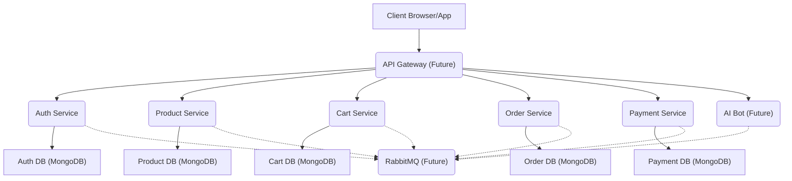
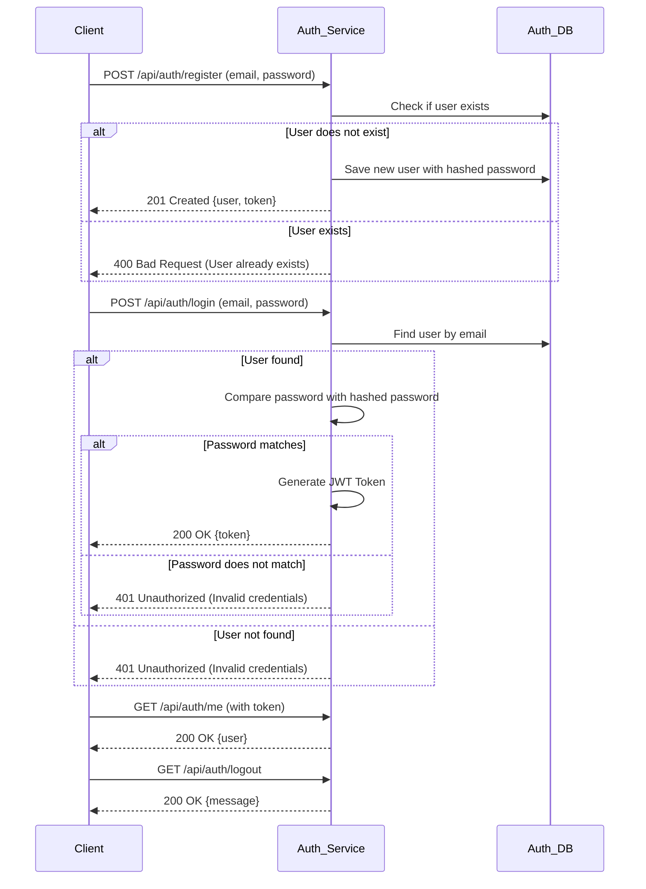
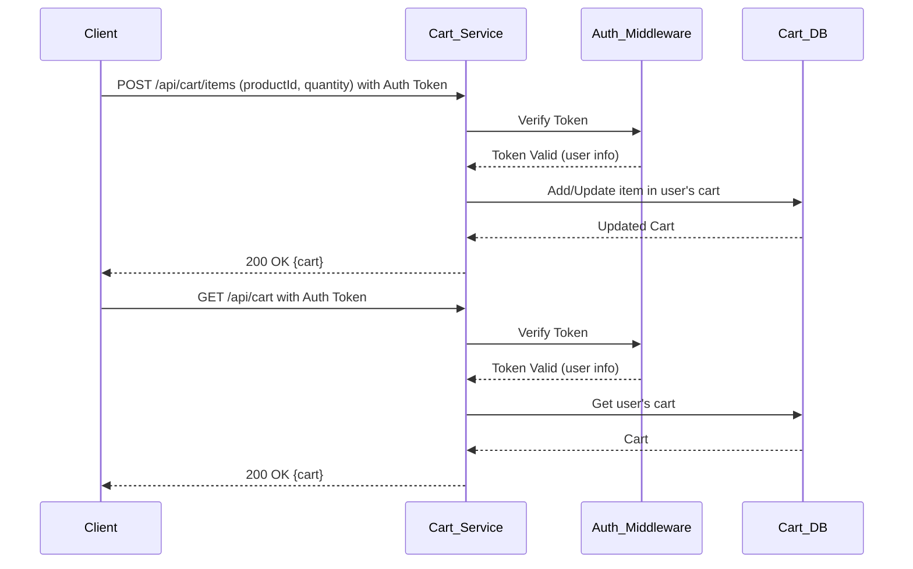

# 🚀 microBazaar: Your Next-Gen Microservices E-commerce Platform 🚀

Welcome to **microBazaar**! This project is an ambitious journey into building a scalable, resilient, and feature-rich e-commerce platform using a microservices architecture. We're crafting a digital marketplace where every component works harmoniously yet independently, ensuring a robust and dynamic user experience.

## ✨ The microBazaar Vision: Why Microservices?

Imagine an e-commerce platform that can grow limitlessly, where new features can be added without disrupting existing ones, and where a hiccup in one area doesn't bring down the entire store. That's the power of microservices, and that's the vision for microBazaar!

We're breaking down the traditional monolithic application into smaller, manageable, and independently deployable services. This approach brings a plethora of benefits:

-   **Scalability:** Each service can be scaled independently based on its demand.
-   **Resilience:** A failure in one service won't cascade and affect the entire application.
-   **Agility:** Faster development cycles and easier deployment of new features.
-   **Technology Diversity:** Freedom to choose the best technology stack for each service.

## 🗺️ Architectural Blueprint: How It All Connects

microBazaar is designed as a constellation of specialized services, each handling a distinct domain of the e-commerce ecosystem. Think of it as a bustling marketplace where different shops (microservices) specialize in their craft, yet work together to serve the customer.

Initially, services communicate directly via RESTful APIs. However, our roadmap includes a powerful upgrade:

-   **RabbitMQ for Asynchronous Communication:** To ensure seamless, decoupled, and fault-tolerant communication, we'll be integrating **RabbitMQ**. This message broker will act as the central nervous system, allowing services to communicate asynchronously through events and messages. For example, when a user places an order, the `Order Service` can publish an event to RabbitMQ, and the `Inventory Service` (future) can subscribe to it to update stock, without direct dependencies.

-   **AWS Cloud Hosting:** Each microservice will find its home on **Amazon Web Services (AWS)**. We envision deploying these services independently across various AWS compute options (e.g., EC2, ECS, Lambda), leveraging AWS's robust infrastructure for high availability, scalability, and global reach. Each service will be a separate entity in the cloud, connecting securely to form the complete microBazaar platform.

## 📊 Architecture and Flow Diagrams

### High-Level Architecture



### User Authentication Flow



### New Product Flow


### Cart Management Flow



### Asynchronous Communication with RabbitMQ (Example: Order Creation)


## 🌟 Current Services Spotlight

Here are the foundational services currently powering microBazaar:

### 🔐 Auth Service

-   **Port:** `3000`
-   **Description:** The gatekeeper of microBazaar! This service is responsible for all things user authentication – from secure registration and login to generating and validating access tokens. It ensures that only legitimate users can access protected resources.
-   **Key Technologies:** `Node.js`, `Express`, `MongoDB`, `JWT`, `bcryptjs`, `ioredis` (for session/token management).

#### API Endpoints

| Method | Endpoint                       | Description                      | Auth Required |
| :----- | :----------------------------- | :------------------------------- | :------------ |
| POST   | `/api/auth/register`           | Register a new user              | No            |
| POST   | `/api/auth/login`              | Login a user                     | No            |
| GET    | `/api/auth/me`                 | Get current user details         | Yes           |
| GET    | `/api/auth/logout`             | Logout the current user          | No            |
| POST   | `/api/auth/users/me/addresses` | Add a new address for the user   | Yes           |
| GET    | `/api/auth/users/me/addresses` | Get all addresses for the user   | Yes           |
| DELETE | `/api/auth/users/me/addresses/:addressId` | Delete a user's address | Yes           |


### 🛍️ Product Service

-   **Port:** `3001`
-   **Description:** The heart of our catalog! This service meticulously manages all product-related operations. It handles creating new products, retrieving product details, updating inventory information, and even managing product images with `ImageKit`.
-   **Key Technologies:** `Node.js`, `Express`, `MongoDB`, `ImageKit`, `Multer` (for file uploads).

#### API Endpoints

| Method | Endpoint                | Description                      | Auth Required (Role) |
| :----- | :---------------------- | :------------------------------- | :------------------- |
| POST   | `/api/products`         | Create a new product             | Yes (Admin, Seller)  |
| GET    | `/api/products`         | Get a list of all products       | No                   |
| GET    | `/api/products/:id`     | Get a single product by ID       | No                   |
| PATCH  | `/api/products/:id`     | Update a product                 | Yes (Seller)         |
| DELETE | `/api/products/:id`     | Delete a product                 | Yes (Seller)         |
| GET    | `/api/products/seller`  | Get all products for a seller    | Yes (Seller)         |

### 🛒 Cart Service

-   **Port:** `3002`
-   **Description:** Your shopping companion! This service manages user shopping carts, allowing for items to be added, updated, and removed seamlessly.
-   **Key Technologies:** `Node.js`, `Express`, `MongoDB`, `JWT`.

#### API Endpoints

| Method | Endpoint                  | Description                | Auth Required (Role) |
| :----- | :------------------------ | :------------------------- | :------------------- |
| GET    | `/api/cart`               | Get the user's cart        | Yes (User)           |
| POST   | `/api/cart/items`         | Add an item to the cart    | Yes (User)           |
| PATCH  | `/api/cart/items/:productId` | Update a cart item's quantity | Yes (User)           |
| DELETE | `/api/cart/items/:productId` | Remove an item from the cart | Yes (User)           |

### 📦 Order Service

-   **Port:** `3003`
-   **Description:** This service is responsible for managing orders. It orchestrates the order creation process by communicating with the Cart and Product services to build a new order.
-   **Key Technologies:** `Node.js`, `Express`, `MongoDB`, `axios`.

#### API Endpoints

| Method | Endpoint | Description | Auth Required (Role) |
| :--- | :--- | :--- | :--- |
| POST | `/api/orders` | Create a new order from the user's cart | Yes (User) |
| GET | `/api/orders/me` | Get all orders for the current user | Yes (User) |
| GET | `/api/orders/:id` | Get a specific order by ID | Yes (User, Admin) |
| POST | `/api/orders/:id/cancel` | Cancel an order | Yes (User) |
| PATCH | `/api/orders/:id/address` | Update the shipping address for an order | Yes (User) |

### 💳 Payment Service

-   **Port:** `3004`
-   **Description:** This service handles the payment process. It integrates with Razorpay to create and verify payments for orders.
-   **Key Technologies:** `Node.js`, `Express`, `MongoDB`, `Razorpay`, `axios`.

#### API Endpoints

| Method | Endpoint | Description | Auth Required (Role) |
| :--- | :--- | :--- | :--- |
| POST | `/api/payment/create/:orderId` | Create a new payment for an order | Yes (User) |
| POST | `/api/payment/verify` | Verify a payment | Yes (User) |


## 🚧 Roadmap to Awesomeness: What's Next for microBazaar?

Our journey has just begun! Here's a sneak peek at the exciting features and architectural enhancements we're planning:

-   [x] **Cart Service:** A dedicated service to manage user shopping carts, allowing seamless adding, removing, and updating of items.
-   [x] **Order Service:** The brain behind transactions, handling order creation, processing, status updates, and history.
-   [x] **Payment Service:** Securely integrate with various payment gateways to facilitate smooth and reliable transactions.
-   [ ] **AI Bot Service:** An intelligent companion for our users, offering personalized recommendations, customer support, and more.
-   [ ] **Notification Service:** Keep users informed with real-time updates via email, SMS, or push notifications.
-   [ ] **RabbitMQ Integration:** Implement robust asynchronous communication patterns across all microservices.
-   [ ] **AWS Deployment:** Strategically deploy each microservice to AWS, optimizing for performance, cost, and reliability.
-   [ ] **Frontend Application:** Develop a captivating user interface to bring microBazaar to life!

## 🚀 Getting Started: Join the microBazaar Journey!

Ready to dive into the code? Follow these simple steps to get microBazaar up and running on your local machine:

1.  **Clone the repository:**
    ```bash
    git clone https://github.com/your-username/microBazaar.git
    ```
2.  **Navigate to a service directory:**
    ```bash
    cd microBazaar/auth  # or microBazaar/product or microBazaar/cart or microBazaar/order or microBazaar/payment
    ```
3.  **Install dependencies:**
    ```bash
    npm install
    ```
4.  **Start the development server:**
    ```bash
    npm run dev
    ```
    *(Repeat steps 2-4 for each service you wish to run.)*

## 🛠️ Core Technologies Powering microBazaar

-   **Node.js:** The asynchronous, event-driven JavaScript runtime.
-   **Express.js:** Our flexible and minimalist web application framework.
-   **MongoDB:** A powerful NoSQL database for flexible data storage.
-   **Redis:** An in-memory data structure store, used for caching and session management.
-   **JSON Web Tokens (JWT):** For secure and stateless authentication.
-   **ImageKit:** For efficient image management, optimization, and delivery.
-   **Razorpay:** Our payment processing partner.
-   **Jest:** Our go-to testing framework for robust and reliable code.
-   **RabbitMQ (Planned):** For inter-service communication and message queuing.
-   **AWS (Planned):** Our cloud platform for scalable and resilient deployments.

## 👋 Contributing: Be a Part of microBazaar!

We welcome contributions from everyone! Whether it's a bug fix, a new feature, or an improvement to the documentation, your input is invaluable. Please feel free to open an issue or submit a pull request. Let's build something amazing together!