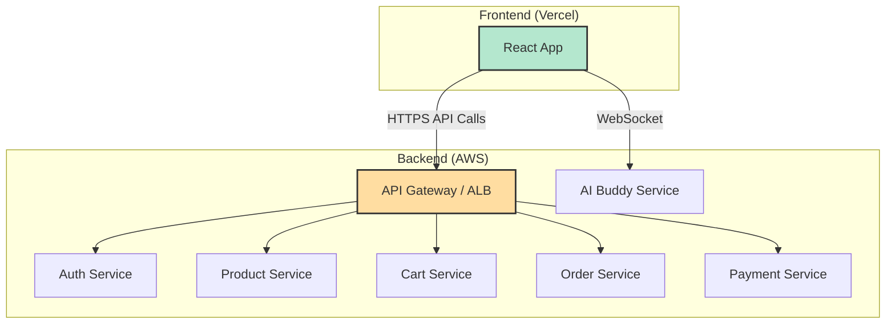

# Frontend Development Report for microBazaar

**Author:** Gemini AI
**Date:** October 1, 2025
**Project:** microBazaar E-commerce Platform
**Frontend Stack:** Vite + React

---

## 1. Introduction

This report outlines a comprehensive strategy for developing the frontend for the microBazaar e-commerce platform. The backend is a sophisticated microservices architecture deployed on AWS, and this document details how to build a corresponding frontend using **Vite and React**.

The plan covers project setup, environment configuration, API communication, state management, core feature implementation, and final deployment to **Vercel**, including custom domain configuration.

### High-Level Frontend Architecture



---

## 2. Project Setup with Vite + React

First, scaffold a new React project using Vite for a fast development experience.

```bash
# 1. Create the Vite project
npm create vite@latest microbazaar-frontend -- --template react

# 2. Navigate into the project directory
cd microbazaar-frontend

# 3. Install dependencies
npm install

# 4. Install axios for API calls and react-router-dom for routing
npm install axios react-router-dom
```

### Recommended Folder Structure

Organize your code for scalability from the start.

```
/src
|-- /api             # Centralized API call management (axios instance)
|-- /components      # Reusable UI components (Button, Input, etc.)
|-- /context         # React Context for global state (Auth, Cart)
|-- /hooks           # Custom hooks (e.g., useAuth, useApi)
|-- /pages           # Top-level page components (HomePage, LoginPage, etc.)
|-- /services        # Business logic for specific services (auth.service.js)
|-- App.jsx
|-- main.jsx
```

---

## 3. Environment Configuration

To securely manage the backend URL, use environment variables. Vite handles this with `.env` files.

Create a file named `.env.local` in your project root:

```env
# The base URL for your deployed AWS Application Load Balancer
VITE_API_GATEWAY_URL=http://microbazzar-alb-1038075917.ap-south-1.elb.amazonaws.com/api
```

You can access this in your code via `import.meta.env.VITE_API_GATEWAY_URL`.

---

## 4. API Communication Layer (Axios)

Create a centralized Axios instance to manage API calls, automatically set the base URL, and handle authentication tokens.

**File: `src/api/axiosInstance.js`**
```javascript
import axios from 'axios';

const axiosInstance = axios.create({
  baseURL: import.meta.env.VITE_API_GATEWAY_URL,
  withCredentials: true // IMPORTANT: This allows cookies to be sent and received
});

// You can add interceptors here later to automatically attach auth tokens
// if you move away from a cookie-based approach.

export default axiosInstance;
```

---

## 5. State Management Strategy

For a project of this scale, a robust state management solution is critical. React Context is a great starting point for managing authentication and user data globally.

**File: `src/context/AuthContext.jsx`**
```javascript
import React, { createContext, useState, useContext } from 'react';

const AuthContext = createContext(null);

export const AuthProvider = ({ children }) => {
  const [user, setUser] = useState(null);
  const [isAuthenticated, setIsAuthenticated] = useState(false);

  // You will call this from your login/register components
  const login = (userData) => {
    setUser(userData);
    setIsAuthenticated(true);
  };

  const logout = () => {
    setUser(null);
    setIsAuthenticated(false);
  };

  return (
    <AuthContext.Provider value={{ user, isAuthenticated, login, logout }}>
      {children}
    </AuthContext.Provider>
  );
};

export const useAuth = () => useContext(AuthContext);
```

Wrap your `App.jsx` with this provider in `main.jsx`.

---

## 6. Implementing Core Features

Here is a detailed breakdown of how to implement each major feature by calling the backend APIs.

### 6.1. User Authentication

**Services Involved:** `auth`

1.  **Registration (`/pages/RegisterPage.jsx`)**
    *   **API Call:** `POST /auth/register`
    *   **Action:** On successful registration, you receive user data. Automatically call the login function to sign the user in and store their data in the `AuthContext`.
    *   **Code Example:**
        ```javascript
        import axiosInstance from '../api/axiosInstance';
        import { useAuth } from '../context/AuthContext';

        const { login } = useAuth();

        const handleRegister = async (formData) => {
          try {
            const response = await axiosInstance.post('/auth/register', formData);
            // The cookie is set automatically by the browser
            login(response.data.user);
            // Redirect to homepage or dashboard
          } catch (error) {
            console.error("Registration failed:", error.response.data);
          }
        };
        ```

2.  **Login (`/pages/LoginPage.jsx`)**
    *   **API Call:** `POST /auth/login`
    *   **Action:** On success, the `token` cookie is set automatically by the browser (`HttpOnly`). Store the returned user object in the `AuthContext`.
    *   **Code Example:**
        ```javascript
        const { login } = useAuth();
        const handleLogin = async (credentials) => {
          try {
            const response = await axiosInstance.post('/auth/login', credentials);
            login(response.data.user);
            // Redirect
          } catch (error) {
            console.error("Login failed:", error.response.data);
          }
        };
        ```

3.  **Logout**
    *   **API Call:** `GET /auth/logout`
    *   **Action:** This clears the `HttpOnly` cookie on the backend. On the frontend, call the `logout` function from `AuthContext` to clear user state and redirect to the login page.

### 6.2. Product Catalog

**Services Involved:** `product`

1.  **Fetch & Display Products (`/pages/ProductsPage.jsx`)**
    *   **API Call:** `GET /products`
    *   **Action:** Fetch a list of all products. You can implement filtering and pagination using query parameters (`q`, `minprice`, `maxprice`, `skip`, `limit`).
    *   **Code Example:**
        ```javascript
        const [products, setProducts] = useState([]);
        useEffect(() => {
          const fetchProducts = async () => {
            const response = await axiosInstance.get('/products?limit=20');
            setProducts(response.data);
          };
          fetchProducts();
        }, []);
        ```

### 6.3. Cart Management

**Services Involved:** `cart`, `product`

1.  **Add to Cart**
    *   **API Call:** `POST /cart/items`
    *   **Action:** Send `{ productId, qty }`. This route is protected, but since you configured `axios` with `withCredentials: true`, the auth cookie is sent automatically.
    *   **Code Example:**
        ```javascript
        const handleAddToCart = async (productId, qty) => {
          await axiosInstance.post('/cart/items', { productId, qty });
          // Optionally, refetch cart to update UI
        };
        ```

2.  **View Cart (`/pages/CartPage.jsx`)**
    *   **API Call:** `GET /cart`
    *   **Action:** Fetches the user's cart. The response includes all items and totals.

### 6.4. Order & Payment Flow

This is a multi-step process involving several services.

1.  **Create Order (`/pages/CheckoutPage.jsx`)**
    *   **API Call:** `POST /orders`
    *   **Action:** This call initiates the order creation process. The backend `order` service will fetch the user's cart and reserve inventory. On success, you will receive an `orderId`.

2.  **Initiate Payment**
    *   **API Call:** `POST /payments/create/:orderId`
    *   **Action:** After creating the order, immediately call this endpoint with the new `orderId`. The backend will create a Razorpay order and return a `razorpayOrderId`.

3.  **Open Razorpay Checkout**
    *   You need the Razorpay client-side SDK.
    *   Use the `razorpayOrderId` to configure and open the Razorpay payment modal.
    *   **Code Example:**
        ```javascript
        const options = {
          key: "YOUR_RAZORPAY_KEY_ID", // Get this from your Razorpay dashboard
          amount: order.amount, // Amount in the smallest currency unit
          currency: "INR",
          name: "microBazaar",
          order_id: razorpayOrderId, // From the previous API call
          handler: function (response) {
            // This function is called on successful payment
            verifyPayment(response);
          },
        };
        const rzp = new window.Razorpay(options);
        rzp.open();
        ```

4.  **Verify Payment**
    *   **API Call:** `POST /payments/verify`
    *   **Action:** The `handler` function from Razorpay gives you `razorpay_payment_id`, `razorpay_order_id`, and `razorpay_signature`. Send these in the body of the verify request. The backend will confirm the payment and publish events.

### 6.5. AI Buddy (WebSockets)

**Services Involved:** `ai-buddy`

1.  **Establish Connection**
    *   Use the `socket.io-client` library.
    *   The backend socket server requires the JWT for authentication. Since the token is in an `HttpOnly` cookie, you can't access it via JS. The socket connection will automatically send the cookie, and the backend is set up to read it.
    *   **Code Example:**
        ```javascript
        import { io } from "socket.io-client";

        // The URL to your AI Buddy service
        const URL = "http://localhost:3005"; // Replace with deployed URL

        const socket = io(URL, {
          withCredentials: true // Crucial for sending the auth cookie
        });

        socket.on("connect", () => {
          console.log("Connected to AI Buddy!");
        });

        socket.on("message", (data) => {
          // Handle incoming messages from the AI
        });
        ```

---

## 7. Deployment to Vercel

1.  **Push to Git:** Ensure your Vite project is on a GitHub or GitLab repository.
2.  **Import to Vercel:** In your Vercel dashboard, select "Add New... -> Project" and import your Git repository.
3.  **Configure Project:**
    *   Vercel will automatically detect that it's a Vite project.
    *   The **Build Command** should be `npm run build`.
    *   The **Output Directory** should be `dist`.
4.  **Set Environment Variable:**
    *   Go to your project's **Settings -> Environment Variables**.
    *   Add a new variable:
        *   **Name:** `VITE_API_GATEWAY_URL`
        *   **Value:** `http://microbazzar-alb-1038075917.ap-south-1.elb.amazonaws.com/api`
5.  **Deploy:** Click the "Deploy" button. Vercel will build and deploy your site, providing you with a unique URL.
6.  **Add Custom Domain:**
    *   Go to **Settings -> Domains**.
    *   Enter your custom domain (e.g., `www.mymicrobazaar.com`) and follow the instructions to update your DNS records (usually adding a CNAME or A record).

---

## 8. Critical Consideration: CORS

**This is the most important step for connecting Vercel to AWS.**

Your backend services running on AWS will reject requests from your Vercel domain by default due to Cross-Origin Resource Sharing (CORS) policy.

You must configure CORS in each of your backend Express services.

**Example `cors` middleware configuration in each service's `app.js`:**

```javascript
const express = require('express');
const cors = require('cors');
const cookieParser = require('cookie-parser');

const app = express();

// Define allowed origins
const allowedOrigins = [
  'http://localhost:5173', // Your local Vite dev server
  'https://your-vercel-deployment-url.vercel.app',
  'https://www.your-custom-domain.com'
];

const corsOptions = {
  origin: (origin, callback) => {
    // Allow requests with no origin (like mobile apps or curl requests)
    if (!origin) return callback(null, true);
    if (allowedOrigins.indexOf(origin) === -1) {
      const msg = 'The CORS policy for this site does not allow access from the specified Origin.';
      return callback(new Error(msg), false);
    }
    return callback(null, true);
  },
  credentials: true // This is critical for cookies
};

app.use(cors(corsOptions));
app.use(cookieParser());
app.use(express.json());

// ... rest of your app.js
```

**You must redeploy your backend services to AWS after adding this CORS configuration.** Without it, your frontend will not be able to communicate with the backend.
